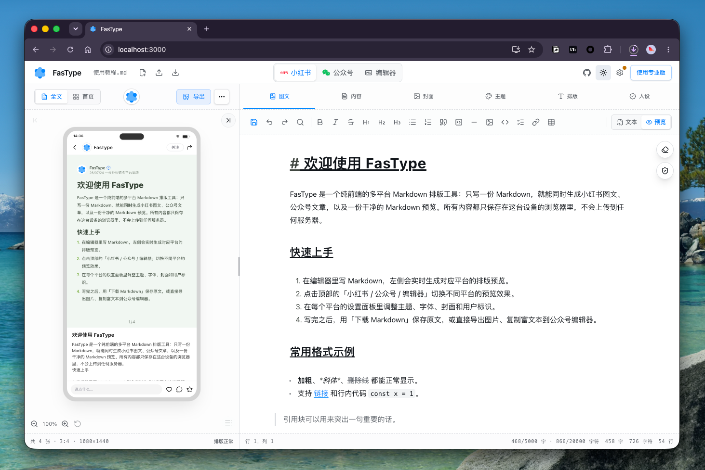
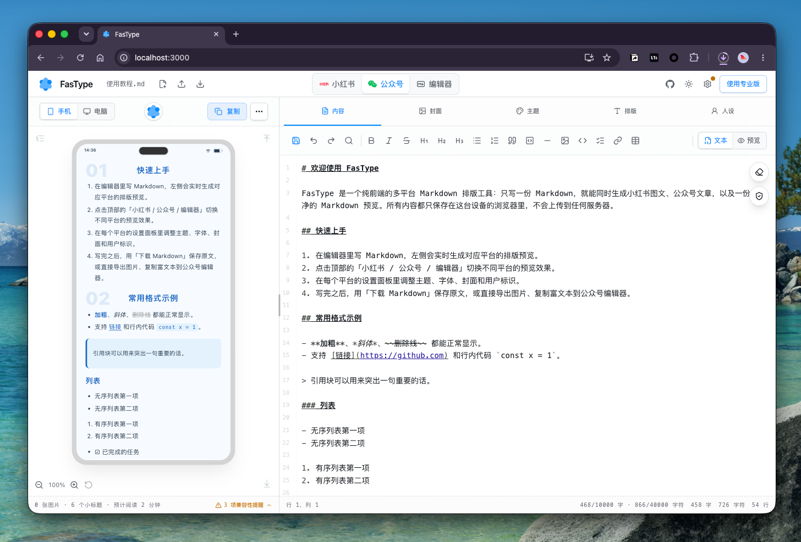
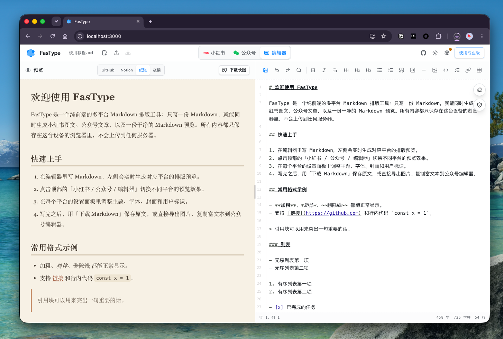
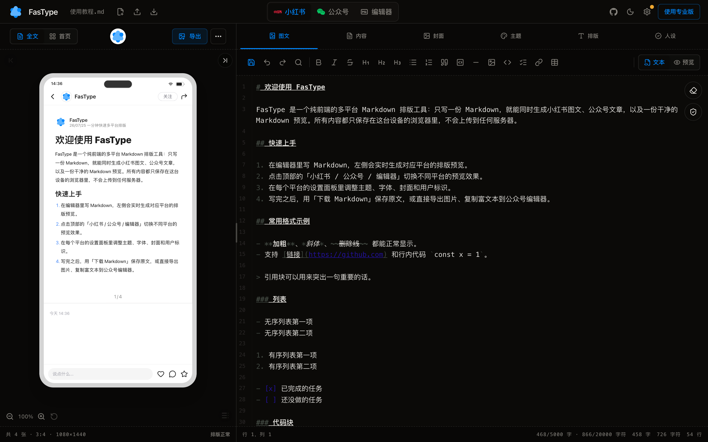
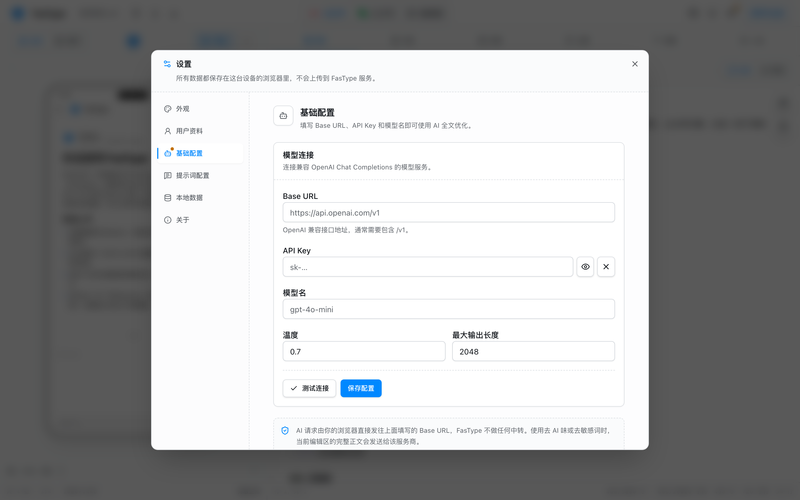
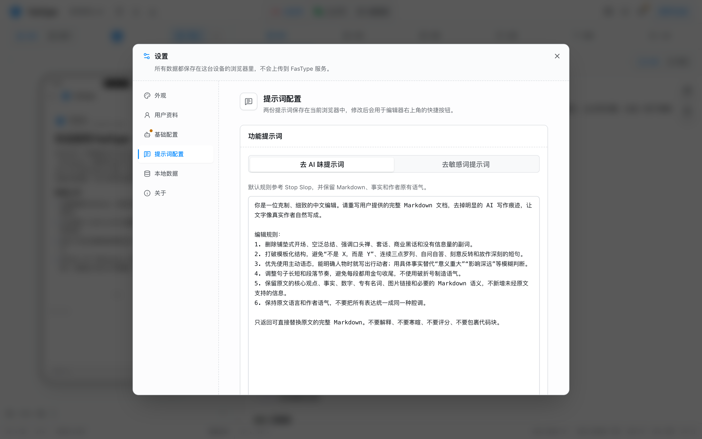
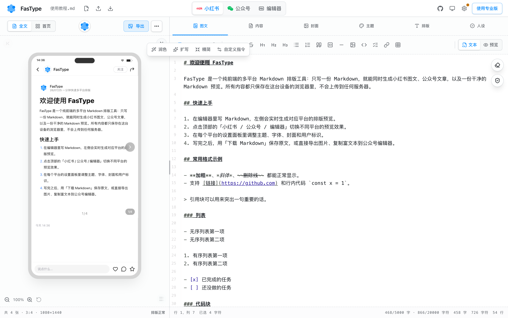
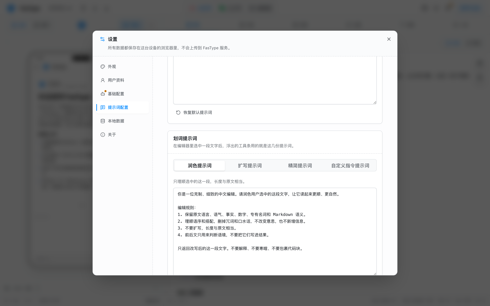
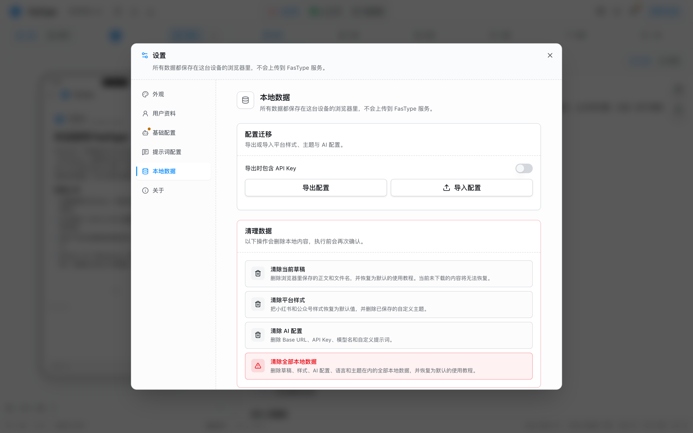

<p align="center">
  
</p>

<h1 align="center">FasType</h1>

<p align="center">一篇 Markdown，写完就能带走。</p>

<p align="center">
  <a href="https://github.com/ai-graveyard/fastype/actions/workflows/ci.yml"></a>
  <a href="https://github.com/ai-graveyard/fastype/releases"></a>
  <a href="LICENSE"></a>
</p>

FasType 是一个**无需账号、没有后端**的轻量写作工具。一次只处理一篇 Markdown，帮你完成三件事：

- **写** —— 左预览、右源码的 Markdown 编辑器
- **排** —— 一份正文，同时生成小红书分页图片和微信公众号富文本
- **改** —— 填自己的 API Key，用自己的模型做轻量改写

所有数据都留在你的浏览器里。不使用 AI 时，正文不会离开这台设备。

**在线体验：[fast.lovtype.com](https://fast.lovtype.com)** —— 无需安装，打开即用。

## 截图

| 小红书 | 公众号 | 编辑器 |
| --- | --- | --- |
|  |  |  |

深色模式（浅色 / 深色 / 跟随系统三选一）：



## 快速开始

直接打开 [fast.lovtype.com](https://fast.lovtype.com) 就能用，没有登录页，也没有新手向导。

想在本地跑或参与开发：

```bash
pnpm install
pnpm dev
```

打开 http://localhost:3000 直接开始写。

## 功能

| 模块 | 能力 |
| --- | --- |
| 文档 | 新建、打开、拖入、3 秒自动保存、下载、单份本地草稿自动恢复 |
| 编辑器 | CodeMirror 6、语法高亮、格式工具栏、搜索替换、经典预览主题、源码与预览双向滚动同步、复制带格式（粘进公众号 / 飞书 / Word 保留排版）、预览长图下载、导出单文件 HTML、保存 PDF、字数与光标统计 |
| 图文 | 本地图片选择 / 拖入 / 粘贴插入（自动压缩后内嵌为 data URI）、图片工具条调宽度与左中右对齐、自由比例裁剪；代码块按语言高亮；` ```mermaid ` 画流程图、` ```markmap ` 画思维导图 |
| 小红书 | “内容”编辑器支持文本 / 可编辑 Markdown 预览、7 种常用比例与自定义画布、7 套主题 + 可保存的自定义主题、元素级样式、页码/用户标识/二维码、自动分页、批量 PNG 导出（打包为 ZIP） |
| 公众号 | “内容”编辑器支持文本 / 可编辑 Markdown 预览、“封面”可制作 900×383 横版与 500×500 方形图、7 套主题 + 可保存的自定义主题、8 套标题模板、元素级排版、身份/引导卡片、内联 HTML 复制与下载 |
| AI | BYOK 配置、连接测试、全文去 AI 味 / 去敏感词、一次生成 5 个候选标题、划词浮层做润色/扩写/精简/口语化/去格式/自定义指令、七份提示词均可编辑、流式输出、确认后才替换正文 |
| 界面 | 浅色 / 深色 / 跟随系统，简体中文 / English，平台成品预览可调分栏，内容编辑器支持源码 / Live Preview |

### 三个视图，一份正文

三个主视图共用同一份 Markdown 和同一套解析规则：

- **小红书 / 公众号** —— 左侧保持成品预览，右侧“内容”编辑器可在带行号的 Markdown 源码与无行号的可编辑预览之间切换
- **编辑器** —— 预览与源码双栏，默认 50% : 50%，可拖动分隔条调整比例，各视图独立记住自己的设置

### 预览即导出

小红书卡片默认以 1080×1440 的真实尺寸渲染（预览只是外层做了一层 CSS 缩放），导出 PNG 截取的就是这棵未缩放的 DOM，所以**预览看到什么，导出就是什么**——字体、颜色、分页、图片位置都不会走样。公众号同理：预览显示的 HTML 和「复制到公众号」写入剪贴板的 HTML 是同一份产物。

### 分页不会静默裁切

小红书长文自动分页。块尽量整体放置；标题不会孤零零留在页尾；实在放不下的列表、表格、代码块和长段落会按条目、行、句子拆开；既放不下又拆不开的内容会单独成页并明确提示，绝不悄悄裁掉。

### 图片跟着文件走

从本地插入的图片会先缩到 1600px 以内再编码成 data URI 写进 Markdown，而不是存在别处再引用——`.md` 拷到哪台机器、传给谁，图都还在。源码里那一长串 base64 在编辑器里折叠成 `PNG 234 KB` 这样的小标签，写作时看到的仍是清爽的一行。

调过宽度或对齐的图片落成 `<p align="center"></p>`，用的是 HTML 属性而不是 style —— GitHub、Typora 也认这两个属性，带走之后排版还在。

### 字体：一处例外

排版字体基本都用系统自带的，不请求任何第三方字体服务。**行楷是唯一的例外**：它在 Windows 和 Linux 上没有任何近似替代，选了只会悄悄退回宋体，同一份文档换台机器导出就不是一回事。所以项目自托管了一份 OFL 授权的[马善政楷书](https://fonts.google.com/specimen/Ma+Shan+Zheng)，按 `unicode-range` 切片按需加载——不选行楷一个字节都不会下载，选了也只下正文用到的那几片。

新魏和琥珀同样只有 macOS 有，但找不到授权合适的替代品，字体选择器上给它们标了 `macOS` 角标。

## 静态部署

FasType 是纯前端应用，构建产物是一堆静态文件，任何静态文件服务器都能托管：

```bash
pnpm build      # 产物在 out/
```

| 平台 | 做法 |
| --- | --- |
| Cloudflare Pages / Netlify | 构建命令 `pnpm build`，输出目录 `out` |
| Vercel | 识别 Next.js 静态导出，无需额外配置 |
| GitHub Pages | 仓库子路径部署时需设置 `NEXT_PUBLIC_BASE_PATH` |
| 任意静态服务器 | 把 `out/` 整个目录扔上去即可 |

部署到 `https://user.github.io/fastype/` 这类子路径时：

```bash
NEXT_PUBLIC_BASE_PATH=/fastype pnpm build
```

运行时不需要 Node.js 服务、数据库、Redis、队列或对象存储。项目里没有 Route Handler，也没有 Server Action。

### 用 Docker 跑自己的一份

仓库里带了 `Dockerfile`（多阶段：Node 构建静态产物 → nginx 托管）和 `deploy/docker-compose.yaml`。镜像在你自己的机器上构建，不依赖任何镜像仓库：

```bash
cd deploy
cp .env.example .env          # 按需改 FASTYPE_PORT，默认 3000
docker compose up -d --build
```

然后打开 http://localhost:3000。

根目录的 `Makefile` 把常用操作包了一层：

| 命令 | 作用 |
| --- | --- |
| `make build` | 构建镜像 |
| `make start` / `make stop` / `make restart` | 起停服务 |
| `make logs` | 跟踪日志 |
| `make deploy` | `git pull` + 重新构建 + 重启，服务器上用这条 |

## 桌面客户端

除了网页版，FasType 也能用 [Tauri](https://tauri.app) 打成 macOS 和 Windows 的原生客户端。壳里跑的还是同一份静态产物，功能与网页版一致，只是多了独立窗口和 Dock / 开始菜单图标。

安装包在 [Releases](https://github.com/ai-graveyard/fastype/releases) 页面下载：macOS 取 `.dmg`，Windows 取 `-setup.exe`（NSIS）或 `.msi`。

安装包**没有做代码签名**（Apple 签名公证和 Windows 代码签名都要付费证书），所以首次打开需要手动放行：

| 平台 | 现象 | 放行方式 |
| --- | --- | --- |
| macOS | 提示应用「已损坏」或来自身份不明的开发者 | 在「访达」里右键点应用选「打开」，或执行 `xattr -dr com.apple.quarantine /Applications/FasType.app` |
| Windows | SmartScreen 提示「Windows 已保护你的电脑」 | 点「更多信息 → 仍要运行」 |

本地构建（产物在 `src-tauri/target/release/bundle/`）：

```bash
pnpm desktop:dev      # 开发模式，前端热更新
pnpm desktop:build    # 打出当前平台的安装包
```

需要 [Rust 工具链](https://www.rust-lang.org/tools/install)；macOS 还需要 Xcode Command Line Tools，Windows 需要 MSVC 生成工具和 WebView2。

**不能交叉编译**：Windows 包要 MSVC 链接器，macOS 包要 Xcode，两边都只能在对应系统上构建。所以两个平台的正式包由 `.github/workflows/desktop-release.yml` 在各自的 runner 上原生构建——推一个 `v*` 标签就会触发，产物挂到同名 Release 的草稿上。

## AI：浏览器直连你自己的模型

在「设置 → AI 配置」中填写：

- **Base URL** —— OpenAI 兼容的 Chat Completions 端点，通常需要包含 `/v1`
- **API Key**
- **模型名**

请求由**你的浏览器直接发往这个地址**，不经过任何 FasType 服务。你可以在浏览器网络面板里确认这一点。

| 填 Key 与测试连接 | 提示词可改 |
| --- | --- |
|  |  |

### 两种用法：全文和划词

**全文**——编辑区右上角的「去 AI 味」「去敏感词」把整篇正文交给模型，结果先在差异对比里看过再决定要不要替换。同一列还有「起标题」：基于全文或几个关键词一次生成 5 个候选，点哪个用哪个，只替换正文里的一级标题，其余一个字不动。

**划词**——在编辑器里选中一段，浮出工具条，只处理这一段：



| 动作 | 做什么 |
| --- | --- |
| 润色 | 理顺语序、删冗词，长度与原文相当 |
| 扩写 | 在原意基础上补细节，不编造事实 |
| 精简 | 压缩表达，保留全部关键事实 |
| 口语化 | 拆开长句和名词堆叠，改成日常说法 |
| 去格式 | 剥掉 Markdown 标记（小红书正文只收纯文本）。**在本地完成，不发请求、不消耗额度** |
| 自定义指令 | 你自己写一句要求，只作用于选中这段 |

划词只发送**选中的文字加前后各 400 字符**的上下文，不会把整篇文章送出去。结果流式显示在浮层里，可以「替换选中内容」或「插入到选中内容之后」，也可以直接丢弃——不点就不会动正文，落笔后 Cmd/Ctrl + Z 能原样撤回。生成期间那段原文若被改动，浮层会拒绝落笔并提示重选，不会覆盖新内容。

### 提示词全都能改

上面六个动作用的都是可见、可改、可恢复默认的提示词，全存在你自己的浏览器里：



### 哪些服务能直连

浏览器发起的跨域请求需要目标服务放行 CORS。常见的 OpenAI 兼容服务实测如下（2026-07-25，用 `OPTIONS` 预检加 `Origin: https://fast.lovtype.com` 探测，全部放行）：

| 服务 | Base URL |
| --- | --- |
| OpenAI | `https://api.openai.com/v1` |
| OpenRouter | `https://openrouter.ai/api/v1` |
| DeepSeek | `https://api.deepseek.com/v1` |
| 硅基流动 | `https://api.siliconflow.cn/v1` |
| 月之暗面 Kimi | `https://api.moonshot.cn/v1` |
| 阿里云百炼 | `https://dashscope.aliyuncs.com/compatible-mode/v1` |
| 火山方舟 | `https://ark.cn-beijing.volces.com/api/v3` |
| 智谱 BigModel | `https://open.bigmodel.cn/api/paas/v4` |

想自己复核某个服务，把 Base URL 换进这条命令，看有没有回 `access-control-allow-origin`：

```bash
curl -si -X OPTIONS https://api.example.com/v1/chat/completions \
  -H "Origin: https://fast.lovtype.com" \
  -H "Access-Control-Request-Method: POST" \
  -H "Access-Control-Request-Headers: authorization,content-type" | grep -i access-control
```

预检通过只说明浏览器不会拦，Key 有没有额度、模型名对不对是另一回事——用设置里的「测试连接」按钮验完整链路。

### 本地模型和自建网关

本地模型默认往往只放行 `localhost` 来源，把 FasType 部署到域名上之后就连不通了，需要显式加来源：

| 服务 | 放行方式 |
| --- | --- |
| Ollama | 设环境变量 `OLLAMA_ORIGINS`，例如 `OLLAMA_ORIGINS="https://fast.lovtype.com"`，Base URL 填 `http://localhost:11434/v1` |
| LM Studio | 在本地服务器设置里打开 CORS |
| vLLM | 启动时加 `--allowed-origins`（底层是 FastAPI 的 CORS 中间件） |
| one-api / LiteLLM 等网关 | 在网关侧配置允许来源 |

### 连不上时怎么排查

浏览器出于安全考虑不会告诉页面跨域失败的具体原因，所以「服务没起来」和「CORS 没放行」的报错看起来一模一样，只能逐个排除：

1. 先确认模型服务在运行、Base URL 没写错（漏掉 `/v1` 是最常见的错误）
2. 再用上面那条 `curl` 确认服务端放行了你这个来源

FasType **不提供**绕过 CORS 的后端代理——那会违背「没有后端」这个前提。真连不通的话，要么在服务端配好 CORS，要么在本地跑 FasType 直连本地模型。

### 混合内容

如果 FasType 部署在 HTTPS 上，浏览器会拦截它对 `http://` 接口的请求。要么换用 HTTPS 接口，要么在本地以 HTTP 运行 FasType。`localhost` 是例外，浏览器视其为安全来源。

## 数据边界

| 数据 | 存在哪 | 是否离开设备 |
| --- | --- | --- |
| Markdown 正文 | 浏览器 localStorage、你选择的本地文件 | 仅在你主动使用 AI 时，发送选中文本及少量上下文 |
| 小红书 / 公众号样式 | 浏览器 localStorage | 否 |
| 公众号封面设置与压缩裁剪图 | 浏览器 localStorage | 否 |
| API Key | 浏览器 localStorage | 仅随你主动发起的模型请求发往你填写的 Base URL |
| 远程图片 URL | Markdown 正文 | 浏览器会直接向图片来源站点请求 |
| 使用分析 | —— | 没有埋点，没有遥测 |

关于 API Key：

- 它只保存在当前浏览器的 localStorage 中。**这不等同于系统钥匙串加密**，共用设备请谨慎。
- 它不会出现在 URL、日志、错误提示、导出的图片或下载的文件里。
- 导出配置时默认**不包含** API Key，需要主动勾选才会带上。
- 设置里可以随时单独清除 AI 配置。

「设置 → 本地数据」把这些开关摆在明面上——导出是否带 Key 默认关闭，草稿、样式、AI 配置可以分别清除：



## 已知限制

- **远程图片导出**：把远程图片画进 canvas 需要图片来源站点允许跨域读取。不允许时导出的 PNG 里会缺这张图，界面会明确提示。FasType 不提供图片代理。
- **小红书导出**：导出全部页面时会把所有 PNG 打包成一个 ZIP，只触发一次下载；仍可单独导出当前图片。
- **公众号最终效果**：以粘贴到微信编辑器后的结果为准。表格、代码块和外部链接在公众号里各有限制，预览中会给出提示。
- **公众号封面原图**：只在当前裁剪窗口使用，不会保存；本地仅保存裁好的 WebP 结果，下载时再生成 900×383 与 500×500 PNG。
- **写回原文件**：依赖 File System Access API。授权后，编辑期间每 3 秒自动写回一次；不支持或未授权时仍会自动保存浏览器本地草稿，并可随时「下载 Markdown」。
- **localStorage**：容量有限。公众号封面会保存两张压缩后的本地裁剪图，其余图片二进制不会写入；写满时会停止自动保存并提示你立刻下载正文，不会覆盖最后一份可读数据。

## 开发

```bash
pnpm dev          # 开发服务器
pnpm build        # 静态导出到 out/
pnpm start        # 本地预览构建产物
pnpm typecheck    # TypeScript
pnpm lint         # ESLint
pnpm test         # Vitest
pnpm check        # 以上全部跑一遍

pnpm desktop:dev      # Tauri 桌面客户端开发模式
pnpm desktop:build    # 打出当前平台的桌面安装包
```

想参与开发？目录结构、硬约束和测试要求见 [CONTRIBUTING.md](CONTRIBUTING.md)。

## 技术栈

Next.js（App Router，静态导出）、React、TypeScript、Tailwind CSS、Shadcn/ui（基于 Radix UI）、Lucide、CodeMirror 6、marked、DOMPurify、html-to-image、jszip（批量导出打包）、qrcode、react-advanced-cropper（头像 / 封面裁剪）、gray-matter（小红书 Front Matter 解析）、sonner（轻提示）。桌面客户端用 Tauri 2 打包。

不引入第三方运行时脚本、远程字体和默认遥测。

## 许可证

[MIT](LICENSE)
